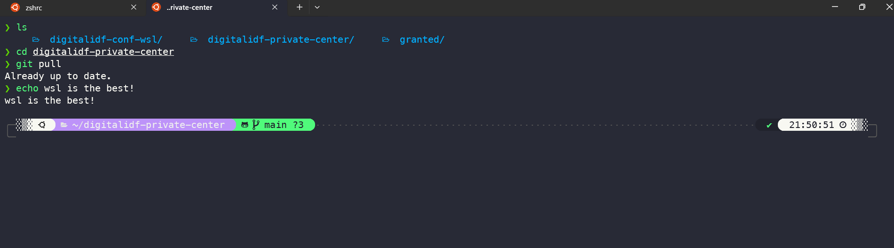

# Configured WSL

A comprehensive WSL configuration project for DevOps, SRE, and Developer environments.



## 🚀 What This Project Provides

This project automates the setup of a complete development environment in WSL2 with:

- **Shell Enhancement**: PowerLevel10k theme with Oh-My-Zsh
- **Development Tools**: Python, Node.js, Docker, Git, and more
- **DevOps Tools**: kubectl, k9s, AWS CLI, Terraform tools
- **Package Management**: Homebrew integration
- **AWS & Kubernetes**: Pre-configured tools for cloud operations
- **Terminal**: Windows Terminal with custom settings

## 📋 Prerequisites

Before you begin, ensure you have:

- **WSL 2** installed and running
- **Windows Terminal** - [Download from Microsoft Store](https://apps.microsoft.com/detail/9n0dx20hk701?rtc=1&hl=he-il&gl=IL)
- **Nerd Fonts** - [Download from GitHub](https://github.com/romkatv/dotfiles-public/tree/master/.local/share/fonts/NerdFonts)

## 🛠️ Installation

### Step 1: Install Oh-My-Zsh

Run these commands in your WSL terminal:

```bash
sudo apt update
sudo apt install zsh
sh -c "$(curl -fsSL https://raw.githubusercontent.com/ohmyzsh/ohmyzsh/master/tools/install.sh)"
```

### Step 2: Clone and Run Configuration

```bash
git clone https://github.com/oshri22004/configured-wsl.git
cd configured-wsl
chmod +x configure_my_wsl.sh
./configure_my_wsl.sh
```

> ⏱️ **Note**: The installation process takes approximately 10 minutes. You can run the script multiple times safely.

### Step 3: Configure Your Theme

After installation, start a new shell session and run:

```bash
p10k configure
```

### Step 4: Validate Installation (Optional)

Run the validation script to ensure everything is properly configured:

```bash
./validate_setup.sh
```

## ⚙️ Additional Configuration

### AWS & Kubernetes Setup

The repository includes an additional script for AWS and Kubernetes configuration:

```bash
chmod +x config-aws-kube.sh
./config-aws-kube.sh
```

> 📝 **Note**: Edit the script and update the TODO sections with your specific AWS and Kubernetes configurations before running.

## 📦 Installed Tools

### System Packages
- Essential development tools (build-essential, git, curl, etc.)
- Docker CE with containerd
- Ruby and RubyGems
- Python development tools
- And 600+ other essential packages

### Homebrew Packages
- AWS CLI
- kubectl & kubectx
- k9s (Kubernetes dashboard)
- jq & yq (JSON/YAML processors)
- Node.js & npm
- Python 3.12
- GitHub CLI
- And more...

### Zsh Plugins
- PowerLevel10k theme
- zsh-autosuggestions
- zsh-syntax-highlighting
- OhMyZsh-full-autoupdate

## 🎯 Features

- **Automated Setup**: One-command installation
- **Idempotent**: Safe to run multiple times
- **Comprehensive**: Includes all essential DevOps tools
- **Customizable**: Easy to modify package lists
- **Windows Integration**: Chrome browser integration
- **Security**: GPG key setup for password management

## 🔧 Customization

### Adding/Removing Packages

#### System Packages
Edit `package_list.txt` to add or remove system packages:
```bash
vim package_list.txt
```

#### Homebrew Packages
Edit `my_brews.txt` to add or remove Homebrew packages:
```bash
vim my_brews.txt
```

For extended package lists, check `my_brews_extended.txt`.

### Terminal Settings
The `settings.json` file contains Windows Terminal configuration that gets automatically applied.

### Backup Configuration
Before making changes, create a backup of your current configuration:
```bash
./backup_config.sh
```

## 🔍 Troubleshooting

If you encounter issues, check the [Troubleshooting Guide](TROUBLESHOOTING.md) for common problems and solutions.

## 🧪 Available Scripts

- `configure_my_wsl.sh` - Main configuration script
- `config-aws-kube.sh` - AWS and Kubernetes setup
- `validate_setup.sh` - Validate the installation
- `backup_config.sh` - Backup current configuration

## 🤝 Contributing

1. Fork the repository
2. Create a feature branch
3. Make your changes
4. Test thoroughly
5. Submit a pull request

## 📝 License

This project is open source and available under the [MIT License](LICENSE).

## 🐛 Issues

If you encounter any issues, please [create an issue](https://github.com/oshri22004/configured-wsl/issues) on GitHub.

## 🙏 Acknowledgments

- [Oh My Zsh](https://ohmyz.sh/) community
- [PowerLevel10k](https://github.com/romkatv/powerlevel10k) theme
- [Homebrew](https://brew.sh/) project
- All the amazing tool developers that make DevOps easier